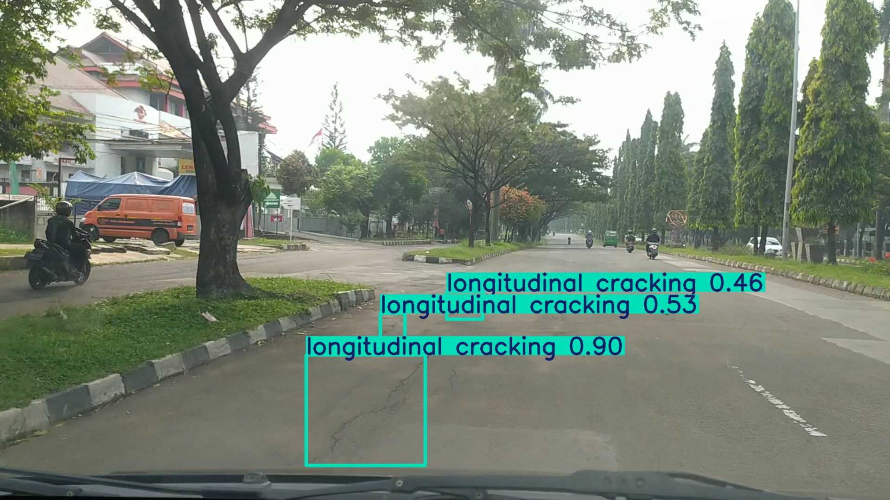
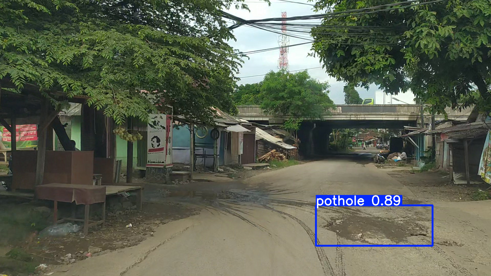

# 路桥缺陷图像识别系统

---
## 描述

基于YOLOv9

---
## 示例

---
## 功能与性能

- 从图像中识别路桥缺陷。

### 训练和验证结果

#### 训练

- 100个周期在2.642小时内完成。
- 模型文件大小为51.6MB。

#### 验证

- Ultralytics YOLOv8.2.36 🚀
- Python-3.12.0
- torch-2.3.1+cu121
- CUDA:0 (NVIDIA GeForce RTX 3080 Laptop GPU, 16384MiB)
- YOLOv9c 概要 (融合后): 384层，25322332个参数，0个梯度，102.3 GFLOPs

#### 验证结果

| 类别                  | 图片数 | 实例数 | Box(P) | R    | mAP50 | mAP50-95 |
|---------------------|-------|-------|-------|------|-------|---------|
| 所有类别              | 703   | 1526  | 0.623 | 0.632| 0.618 | 0.298   |
| 坑洞                  | 299   | 629   | 0.702 | 0.731| 0.729 | 0.363   |
| 鳄鱼裂缝              | 156   | 194   | 0.605 | 0.639| 0.612 | 0.312   |
| 横向裂缝              | 188   | 268   | 0.622 | 0.515| 0.542 | 0.208   |
| 纵向裂缝              | 255   | 435   | 0.562 | 0.641| 0.590 | 0.309   |

#### 速度

- 预处理速度: 0.1ms/图片
- 推理速度: 5.1ms/图片
- 损失计算速度: 0.0ms/图片
- 后处理速度: 1.6ms/图片

---
## 安装

请按照以下步骤进行安装：

1. 克隆或下载。
2. 安装依赖`requirements.txt`。

---
## 使用

请按照以下步骤使用：

1. `main.py`。

---
## 训练过程
### 数据预处理
1. 下载并解压数据
2. 使用`transform_data.py`初步转换
3. 把`dataset.yaml`改为你电脑上的绝对路径

---
## 贡献

欢迎贡献代码！

---
## 许可证

本项目使用 MIT 许可证。

---
## 其他

本项目是一个软件工程教学实习小组大作业的一部分。  
*实际上是一个人的作业。*
*由于时间精力有限很多地方由AI辅助完成*
